Wifi localization
================

Synopsis
--------

This project demonstrates logistic regression as a classifier to predict the room a person/device is in, based on the wifi signal state.

Relavent information: The data is obtained from the source [UCI ML database](https://archive.ics.uci.edu/ml/datasets/Wireless+Indoor+Localization).Collected in indoor space by observing signal strengths of seven WiFi signals visible on a smartphone. The decision variable is one of the four rooms. The dataset has 2000 observation with 8 variables and "room" is the interested response Libraries used: readr,caret,e1071,ggplot2,gridExtra,knitr.

``` r
library(readr)
library(knitr)
library(ggplot2);
library(gridExtra)
library(e1071)
library(caret)
```

#### Classification:

Linear regression assumes that the response variable Y is quantitative. However, in many situations we are dealing with qualitative response variables. Generally, we will refer to these types of variables as categorical variables. Classification thereby involves assigning categorical variables to a specific class. Usually, we predict the probability of any observation belonging to a specific class.

There are many classification techniques, or classifiers, that could be used to predict a given qualitative response variables,commoly used one are-

-   Logistic Regression
-   Linear Discriminant Analysis
-   K-nearest neighbors
-   SVM
-   Random forest

Just like linear regression, in classification we have a set of training observations which we leverage to build a classifier, and we test our model performance on the test data to simulate out of sample error. In this project we will use signal strength as model inputs to predict which room an individual is present, using logistic regression.

Overview of Analysis approach
-----------------------------

1.  Data Preprocessing and Visualiaztion
2.  Fitting and analysing a simple model
3.  Data cleaning
4.  Fitting a complete model
5.  Inferences

### Data preprocessing

The data is loaded as wifi, and the response variable is name as "room" and the dataset is attached for easier invoking.Then we examine the preditor variables and check for observations containing "NA" values and

``` r
wifi <- read_delim("wifi_localization.txt","\t", escape_double = FALSE, col_names = FALSE,
                   trim_ws = TRUE)
names(wifi)<-c("X1","X2","X3","X4","X5","X6","X7","room")
wifi$room<-as.factor(wifi$room)
attach(wifi)
table(is.na(wifi))
```

    ## 
    ## FALSE 
    ## 16000

We see there aren't any NA values in the dataset.

### Data preprocessing

Next we look at the head of the dataframe giving a brief snapshot of the data we have.We see there are 8 variable of which seven are predictor variable named as X1,X2,...,X7 and response variable is room.

``` r
kable(head(wifi),caption = "Wifi localization dataframe")
```

|   X1|   X2|   X3|   X4|   X5|   X6|   X7| room |
|----:|----:|----:|----:|----:|----:|----:|:-----|
|  -64|  -56|  -61|  -66|  -71|  -82|  -81| 1    |
|  -68|  -57|  -61|  -65|  -71|  -85|  -85| 1    |
|  -63|  -60|  -60|  -67|  -76|  -85|  -84| 1    |
|  -61|  -60|  -68|  -62|  -77|  -90|  -80| 1    |
|  -63|  -65|  -60|  -63|  -77|  -81|  -87| 1    |
|  -64|  -55|  -63|  -66|  -76|  -88|  -83| 1    |

Lets plot and see the distribution of a single signal variable(all X's are similar) and the number of observations in each class(room).

``` r
plot(wifi$room,xlab="Room no",ylab="Frequency",ylim=c(0,700))
```

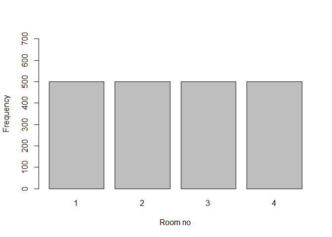

``` r
hist(wifi$X2,xlab = "signal strength",ylab = "frequency",main="Histogram of X2 signal strength")
```

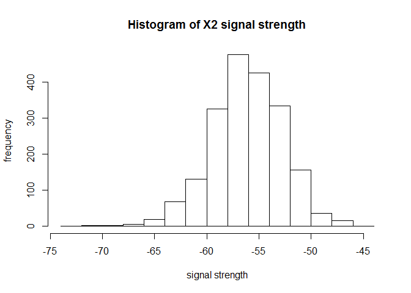

We see a approx. normal distribution for X2 and the each class contains about 25% of total observations, so the class distribution isn't skewed,highly favourable for our analysis.

Next we plot the the class distribution across different predictor variables,a few of them are plotted to give an understanding of how well the class are seperated to differentiate them.

``` r
x <- qplot(x=X1, y=X2, color=room, shape=room,geom='point')+scale_shape(solid=FALSE)
y <- qplot(x=X5, y=X3, color=room, shape=room,geom='point')+scale_shape(solid=FALSE)
z <- qplot(x=X4, y=X7, color=room, shape=room,geom='point')+scale_shape(solid=FALSE)
w <- qplot(x=X6, y=X3, color=room, shape=room,geom='point')+scale_shape(solid=FALSE)
grid.arrange(x,y,z,w, nrow=2)
```

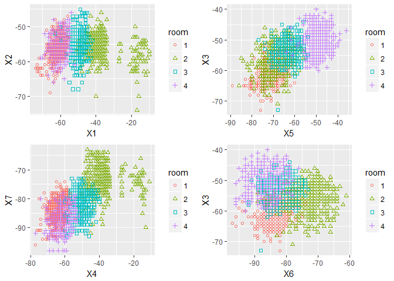

In many plots we see atleast 2 classes have a well differentiable linear boundary with just 2 variables.We will checkout how each predictor variable are distributed for each class.

``` r
qplotter<-function(i){
  a=qplot(x=room, y=wifi[,i], fill=room, geom='boxplot',ylab=names(wifi)[i])+guides(fill=FALSE)
  return(a)
}
grid.arrange(qplotter(1),qplotter(2),qplotter(3),qplotter(4),qplotter(5),qplotter(6),qplotter(7), nrow=2)
```

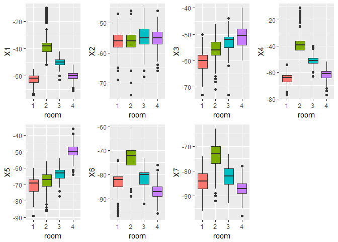

We see that the median for the distribution of variables X1,X4 for each class are separted.Also we see there many be outliers for many of the variables.So we need to do some data cleaning.

For simple understanding, we well model a simple logistic regression on single variable X1.This is a multi-class classification problem as we have four classes, we will use one vs all approach to solve this.In one vs all approach, K-1 logistic model are trained.For training a model for class i, all observations of class i are labelled as 1 and others as 0. As such it becomes a binary classification problem and so similar logistic model are trained K classes(in general its sufficient to train K-1 models).As mentioned before we predict the probability of any observation belonging to a specific class.From the 4 model we get the class probabilities and the observation is labelled to the class with highest probability.

``` r
logisticfn<-function(y,x,frame,class){
  logit <- glm(I(y==class) ~ x, data=frame, family='binomial')
  return(predict(logit,type = "response"))
}
K=4
classprob=matrix(0,2000,K)
for (i in 1:K){
  classprob[,i]=logisticfn(room,X1,wifi,class=i)
}
head(classprob)
```

    ##           [,1]         [,2]      [,3]      [,4]
    ## [1,] 0.6910178 2.033810e-06 0.1947997 0.5149239
    ## [2,] 0.8906185 1.242736e-07 0.1791540 0.6550762
    ## [3,] 0.6181809 4.090652e-06 0.1988693 0.4785843
    ## [4,] 0.4590266 1.654830e-05 0.2071992 0.4069538
    ## [5,] 0.6181809 4.090652e-06 0.1988693 0.4785843
    ## [6,] 0.6910178 2.033810e-06 0.1947997 0.5149239

``` r
predictedclass<-max.col(classprob)
head(predictedclass)
```

    ## [1] 1 1 1 1 1 1

``` r
table(predicted=predictedclass,actual=room)
```

    ##          actual
    ## predicted   1   2   3   4
    ##         1 407   0   3 257
    ##         2   0 467  73   0
    ##         3   1  33 420  19
    ##         4  92   0   4 224

``` r
cat("Accuracy=",mean(predictedclass==room)*100,"\n")
```

    ## Accuracy= 75.9

The above results display the class probabilites and the resulting class labels.We use a confusion matrix to evaluate our model performance, it shows the predicted class vs actual class.We get a training accuracy of about 75.9% on 2000 observations.From the confusion we see that model has done a good job on class 2 and 3 and majority of mismatches are from actual class of 1 and 4, the reasoning for this can done from the earlier boxplot for var X1, we see that distribution of X1 for class 1 and 4 are pretty overlapping and as logistic regression find a linearly seperable line distinguishing two classes, so it natural that many mismatches are from those class as they have distribution in similar range.

#### Data Splitting for validation

The available data is split in 75:25 ratio to obatin training and test datasets.

``` r
set.seed(4)
m=dim(wifi)[1]
ind=sample(seq(m),0.75*m,replace=FALSE)
wifi_train<-wifi[ind,]
wifi_test<-wifi[-ind,]
attach(wifi_train)
```

### Data cleaning

Below is function for detecting outliers and replacing them with *N**A* values in the dataframe.It takes in the dataframe and variable as input.It outputs the details about the outliers.

``` r
outlierKD <- function(dt, var,i) {
     var_name <- eval(substitute(var),eval(dt))
     na1 <- sum(is.na(var_name))
     m1 <- mean(var_name, na.rm = T)
     par(mfrow=c(2, 2), oma=c(0,0,3,0))
     boxplot(var_name, main="With outliers",xlab=names(wifi)[i])
     hist(var_name, main="With outliers", xlab=names(wifi)[i], ylab=NA)
     outlier <- boxplot.stats(var_name)$out
     mo <- mean(outlier)
     var_name <- ifelse(var_name %in% outlier, NA, var_name)
     boxplot(var_name, main="Without outliers",xlab=names(wifi)[i])
     hist(var_name, main="Without outliers", xlab=names(wifi)[i], ylab=NA)
     title("Outlier Check", outer=TRUE)
     na2 <- sum(is.na(var_name))
     cat("Outliers identified:", na2 - na1,"\n")
     cat("Propotion (%) of outliers:", round((na2 - na1) / sum(!is.na(var_name))*100, 1),"\n")
     cat("Mean of the outliers:", round(mo, 2),"\n")
     m2 <- mean(var_name, na.rm = T)
     cat("Mean without removing outliers:", round(m1, 2),"\n")
     cat("Mean if we remove outliers:", round(m2, 2),"\n")
     #response <- readline(prompt="Do you want to remove outliers and to replace with NA? [yes/no]: ")
     response="y"
     if(response == "y" | response == "yes"){
          dt[as.character(substitute(var))] <- invisible(var_name)
          assign(as.character(as.list(match.call())$dt), dt, envir = .GlobalEnv)
          cat("Outliers successfully removed for ",names(wifi)[i],"\n")
          cat("=====================================================","\n")
          return(invisible(dt))
     } else{
          cat("Nothing changed","\n")
          return(invisible(var_name))
     }
     
}
rmoutlier<-function(){
  outlierKD(wifi_train,X1,1)
  outlierKD(wifi_train,X2,2)
  outlierKD(wifi_train,X3,3)
  outlierKD(wifi_train,X4,4)
  outlierKD(wifi_train,X5,5)
  outlierKD(wifi_train,X6,6)
  outlierKD(wifi_train,X7,7)}
```

The training data is cleaned and we can see the number of outliers removed.

``` r
before=dim(wifi_train)[1]
rmoutlier()
```

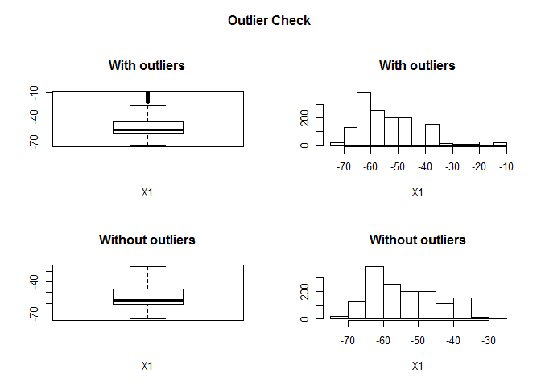

    ## Outliers identified: 40 
    ## Propotion (%) of outliers: 2.7 
    ## Mean of the outliers: -15.72 
    ## Mean without removing outliers: -52.75 
    ## Mean if we remove outliers: -53.76 
    ## Outliers successfully removed for  X1 
    ## =====================================================

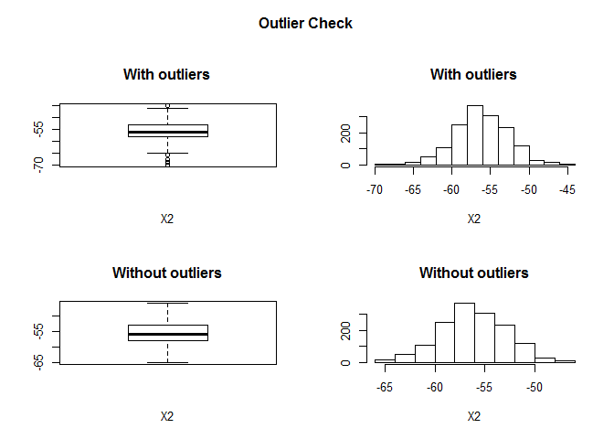

    ## Outliers identified: 9 
    ## Propotion (%) of outliers: 0.6 
    ## Mean of the outliers: -64.89 
    ## Mean without removing outliers: -55.7 
    ## Mean if we remove outliers: -55.65 
    ## Outliers successfully removed for  X2 
    ## =====================================================

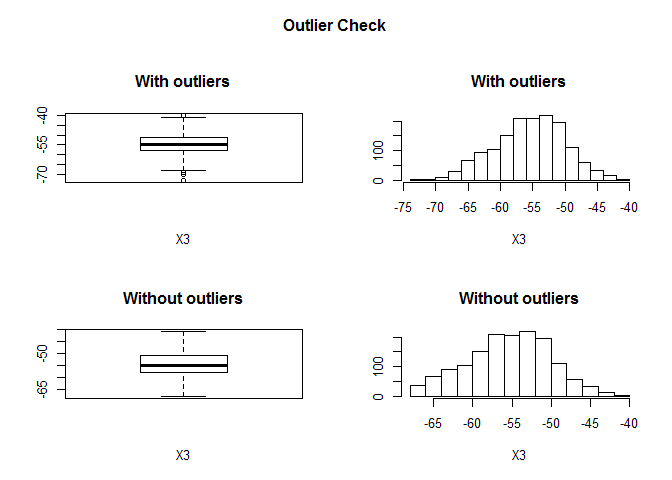

    ## Outliers identified: 7 
    ## Propotion (%) of outliers: 0.5 
    ## Mean of the outliers: -66.29 
    ## Mean without removing outliers: -54.96 
    ## Mean if we remove outliers: -54.91 
    ## Outliers successfully removed for  X3 
    ## =====================================================

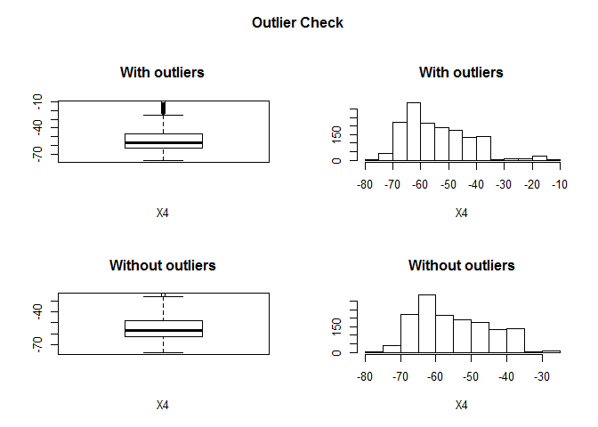

    ## Outliers identified: 35 
    ## Propotion (%) of outliers: 2.4 
    ## Mean of the outliers: -16.69 
    ## Mean without removing outliers: -53.9 
    ## Mean if we remove outliers: -54.78 
    ## Outliers successfully removed for  X4 
    ## =====================================================

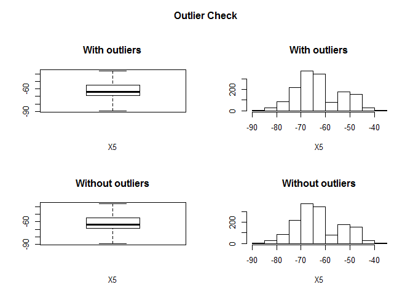

    ## Outliers identified: 0 
    ## Propotion (%) of outliers: 0 
    ## Mean of the outliers: NaN 
    ## Mean without removing outliers: -62.59 
    ## Mean if we remove outliers: -62.59 
    ## Outliers successfully removed for  X5 
    ## =====================================================

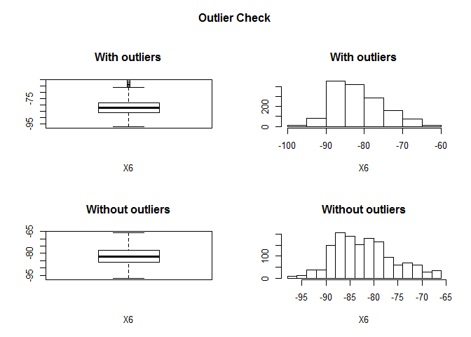

    ## Outliers identified: 21 
    ## Propotion (%) of outliers: 1.4 
    ## Mean of the outliers: -64.29 
    ## Mean without removing outliers: -81.29 
    ## Mean if we remove outliers: -81.53 
    ## Outliers successfully removed for  X6 
    ## =====================================================

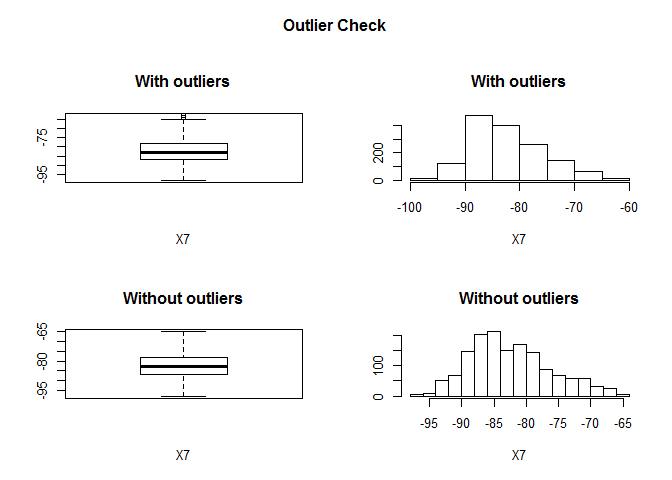

    ## Outliers identified: 11 
    ## Propotion (%) of outliers: 0.7 
    ## Mean of the outliers: -63.91 
    ## Mean without removing outliers: -81.84 
    ## Mean if we remove outliers: -81.97 
    ## Outliers successfully removed for  X7 
    ## =====================================================

``` r
wifi_train<-na.omit(wifi_train)
outliers=before-dim(wifi_train)[1]
cat("Number of outlier ommited",outliers,"\n")
```

    ## Number of outlier ommited 94

### Complete Model

From the variable distribution of each class we can assume a linear seperator in 7 dimensional space could very well work as a classifier. Also since we know that the signal strength from each source are uncorrelated, we can neglect the interaction terms and neglecting higher order polynomial terms which could overfit the data, we will build multi class logistics model with all 7 predictors in the model.Similar to single variable case 4 binary class models are trained from the training dataset(wifi\_train).

``` r
multilogpred<-function(X,K,newdata){
classprob=matrix(0,dim(newdata)[1],K)
for (i in 1:K){
  logit <- glm(I(X$room==i) ~ ., data=X, family='binomial')
  classprob[,i]=predict(logit,newdata = newdata,type = "response")
}
return(classprob)
}
```

We will evaluate the model using training error(misclassification error).As before confusion matrix is created.

``` r
classes=4
classprob<-multilogpred(wifi_train,classes,wifi_train)
predictedclass<-max.col(classprob)
table(predicted=predictedclass,actual=wifi_train$room)
```

    ##          actual
    ## predicted   1   2   3   4
    ##         1 376   0   0   1
    ##         2   0 267  12   0
    ##         3   2  10 353   3
    ##         4   1   0   2 379

``` r
mean(predictedclass==wifi_train$room)
```

    ## [1] 0.9779516

``` r
predictedclass<-as.factor(predictedclass)
confusionMatrix(predictedclass,wifi_train$room)
```

    ## Confusion Matrix and Statistics
    ## 
    ##           Reference
    ## Prediction   1   2   3   4
    ##          1 376   0   0   1
    ##          2   0 267  12   0
    ##          3   2  10 353   3
    ##          4   1   0   2 379
    ## 
    ## Overall Statistics
    ##                                          
    ##                Accuracy : 0.978          
    ##                  95% CI : (0.9688, 0.985)
    ##     No Information Rate : 0.2724         
    ##     P-Value [Acc > NIR] : < 2.2e-16      
    ##                                          
    ##                   Kappa : 0.9705         
    ##  Mcnemar's Test P-Value : NA             
    ## 
    ## Statistics by Class:
    ## 
    ##                      Class: 1 Class: 2 Class: 3 Class: 4
    ## Sensitivity            0.9921   0.9639   0.9619   0.9896
    ## Specificity            0.9990   0.9894   0.9856   0.9971
    ## Pos Pred Value         0.9973   0.9570   0.9592   0.9921
    ## Neg Pred Value         0.9971   0.9911   0.9865   0.9961
    ## Prevalence             0.2696   0.1970   0.2610   0.2724
    ## Detection Rate         0.2674   0.1899   0.2511   0.2696
    ## Detection Prevalence   0.2681   0.1984   0.2617   0.2717
    ## Balanced Accuracy      0.9956   0.9766   0.9737   0.9933

We see an accuracy of 97.8% on the training set, also see that the precision and recall of each binary model is above 96%.Next we will evaluate our model on the test set.

``` r
testclassprob<-multilogpred(wifi_train,classes,wifi_test)
testpredictedclass<-max.col(testclassprob)
table(predicted=testpredictedclass,actual=wifi_test$room)
```

    ##          actual
    ## predicted   1   2   3   4
    ##         1 113   0   0   0
    ##         2   0 138   6   0
    ##         3   1   6 120   0
    ##         4   0   0   1 115

``` r
mean(testpredictedclass==wifi_test$room)
```

    ## [1] 0.972

``` r
testpredictedclass<-as.factor(testpredictedclass)
confusionMatrix(testpredictedclass,wifi_test$room)
```

    ## Confusion Matrix and Statistics
    ## 
    ##           Reference
    ## Prediction   1   2   3   4
    ##          1 113   0   0   0
    ##          2   0 138   6   0
    ##          3   1   6 120   0
    ##          4   0   0   1 115
    ## 
    ## Overall Statistics
    ##                                           
    ##                Accuracy : 0.972           
    ##                  95% CI : (0.9535, 0.9846)
    ##     No Information Rate : 0.288           
    ##     P-Value [Acc > NIR] : < 2.2e-16       
    ##                                           
    ##                   Kappa : 0.9625          
    ##  Mcnemar's Test P-Value : NA              
    ## 
    ## Statistics by Class:
    ## 
    ##                      Class: 1 Class: 2 Class: 3 Class: 4
    ## Sensitivity            0.9912   0.9583   0.9449   1.0000
    ## Specificity            1.0000   0.9831   0.9812   0.9974
    ## Pos Pred Value         1.0000   0.9583   0.9449   0.9914
    ## Neg Pred Value         0.9974   0.9831   0.9812   1.0000
    ## Prevalence             0.2280   0.2880   0.2540   0.2300
    ## Detection Rate         0.2260   0.2760   0.2400   0.2300
    ## Detection Prevalence   0.2260   0.2880   0.2540   0.2320
    ## Balanced Accuracy      0.9956   0.9707   0.9631   0.9987

We see an accuracy of 97.2% on the test set.It has a very good accuracy and our assumption was good and the model has genarlized well over the test set.

### Conclusion

-   We have seen how to perform multiclass logistic regression as a classifier.The classes in the dataset had well seperable region, so a model contatining variables of polynomial degree=1 was sufficient to produce a good classifier.
-   Adding many variables in the model would result in a low training error.So futher extension is so build simpler models with few variables that are very easy to interpret and also have low misclassification rate, which essentially depends on the use case, how to balance the error rate and model interpretation.You can refer to my earlier post on linear regression,performing variable selection using subset selection method.
-   In this project I have used logistic regression as a classifier, other classifier such as KNN,LDA are also available, you can try it.In this post I haven't displayed the model trained and understanding the coefficients estimated(will do it next post).
-   Application domain: Detecting users in an indoor environment based on Wi-Fi signal strength has a wide domain of applications. This can be used for objectives like locating users in smart home systems, locating criminals in bounded regions, obtaining the count of users on an access point etc. This project demonstartes a approach that is scalable in real-world.
