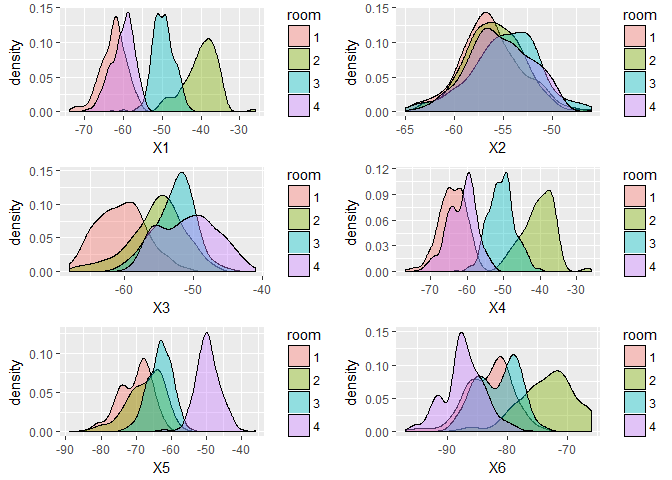
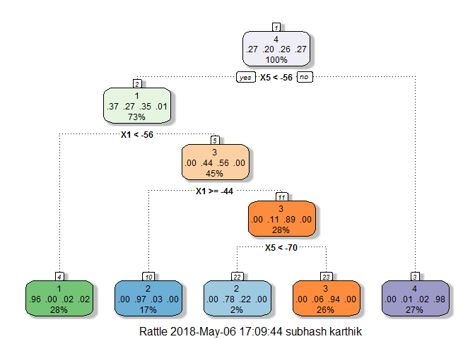

WIFI-part2
================
subhash
28 April 2018

### Naive bayes Classifier

``` r
library(readr)
wifi_train <- read_csv("F:/subhash/UCI datasets/Classification/wifi localization/train_rm_outliers.csv")
wifi_train$room<-as.factor(wifi_train$room)
wifi_test<-read_csv("F:/subhash/UCI datasets/Classification/wifi localization/testfile.csv")
```

Plotting the Distribution of signal strengths to check whether the signal can be modelled from a normal distribution. For naive bayes, we assume the predictor are independent. In our case this condition is satisfied as the signal strength from one source will not depend from other sources.

``` r
nbplotter<-function(i){
  a=ggplot(data=wifi_train,aes(wifi_train[i],fill=room))+geom_density(alpha=0.4)+ xlab(names(wifi_train)[i])
  return(a)
}
grid.arrange(nbplotter(1),nbplotter(2),nbplotter(3),nbplotter(4),nbplotter(5),nbplotter(6),nrow=3)
```



Modelling using gaussian naive bayes

``` r
library(e1071)
NB_classifier <- naiveBayes(room~., data=wifi_train,ra)
pred_nb_train<-predict(NB_classifier,wifi_train)
train_acc_nb<-mean(pred_nb_train==wifi_train$room)
pred_nb_test<-predict(NB_classifier,wifi_test)
confusionMatrix(pred_nb_test,factor(wifi_test$room))
```

    ## Confusion Matrix and Statistics
    ## 
    ##           Reference
    ## Prediction   1   2   3   4
    ##          1 114   0   0   0
    ##          2   0 137   1   0
    ##          3   0   7 126   0
    ##          4   0   0   0 115
    ## 
    ## Overall Statistics
    ##                                           
    ##                Accuracy : 0.984           
    ##                  95% CI : (0.9687, 0.9931)
    ##     No Information Rate : 0.288           
    ##     P-Value [Acc > NIR] : < 2.2e-16       
    ##                                           
    ##                   Kappa : 0.9786          
    ##  Mcnemar's Test P-Value : NA              
    ## 
    ## Statistics by Class:
    ## 
    ##                      Class: 1 Class: 2 Class: 3 Class: 4
    ## Sensitivity             1.000   0.9514   0.9921     1.00
    ## Specificity             1.000   0.9972   0.9812     1.00
    ## Pos Pred Value          1.000   0.9928   0.9474     1.00
    ## Neg Pred Value          1.000   0.9807   0.9973     1.00
    ## Prevalence              0.228   0.2880   0.2540     0.23
    ## Detection Rate          0.228   0.2740   0.2520     0.23
    ## Detection Prevalence    0.228   0.2760   0.2660     0.23
    ## Balanced Accuracy       1.000   0.9743   0.9867     1.00

``` r
test_nb_acc<-mean(pred_nb_test==wifi_test$room)
```

### Decision Trees

``` r
library(rpart)
require(RColorBrewer)
require(rattle)
set.seed(10)
fit.rpart <- rpart(room ~., data = wifi_train)
fancyRpartPlot(fit.rpart)
```



``` r
pred.train.rpart<-predict(fit.rpart,newdata = wifi_train[,1:7],type="class")
accuracy.train=mean(pred.train.rpart==wifi_train$room)
pred.test.rpart<-predict(fit.rpart,newdata = wifi_test[,1:7],type="class")
accuracy.test=mean(pred.test.rpart==wifi_test$room)
cat("Test Accuracy  ",accuracy.test)
```

    ## Test Accuracy   0.976

### Model Interpretability

Different classifiers such as logistic regression, Gaussian Naive bayes and Decision trees were trained to identify the users location. More often, rather than having high classification accuracy business objective would be undestand the how the data support or arrives at the final class output. So it was very important to undestand the buit model and its implications.
The three models have validation accuracy in the range 96%-98%. As mentioned earlier logistic model requires the features of all wifi signal strengths this is a disadvatange, here Decision tree models are favourable because of its high interpretabilty, the above Decision tree shows how one can easily classifify a the users location based on just 2 feature(X1 and X5), often DT's are said to have low performances(Accuracy), but in our case all three models have very good classification accuracy.
